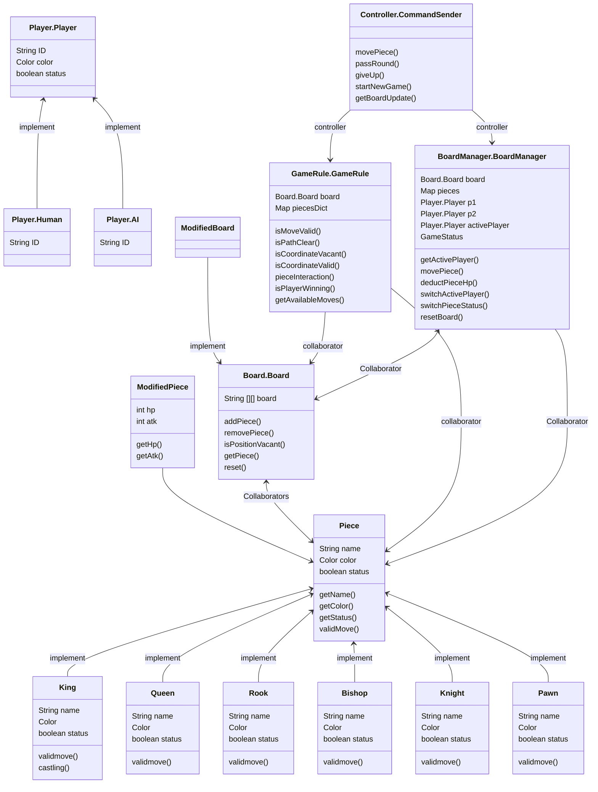

## Class Diagram

Using Mermaid v8.9.1

Class Diagram (Chess Game):

```mermaid
classDiagram
    Player.Player <-- Player.Human : implement
    Player.Player <-- Player.AI : implement
    
    Player.Player : String ID
    Player.Player : Color color
    Player.Player : boolean status
    
    Player.Human : String ID
    
    Player.AI : String ID
    
    
    Piece <-- King : implement
    Piece <-- Queen : implement
    Piece <-- Rook : implement
    Piece <-- Bishop : implement
    Piece <-- Knight : implement
    Piece <-- Pawn : implement
    
    Piece : String name
    Piece : Color color
    Piece : boolean status
    Piece : getName()
    Piece : getColor()
    Piece : getStatus()
    Piece : validMove()
    
    King : String name
    King : Color 
    King : boolean status
    King : validmove()
    King : castling()
    
    Queen : String name
    Queen : Color 
    Queen : boolean status
    Queen : validmove()
    
    Rook : String name
    Rook : Color 
    Rook : boolean status
    Rook : validmove()
    
    Bishop : String name
    Bishop : Color 
    Bishop : boolean status
    Bishop : validmove()
    
    Knight : String name
    Knight : Color 
    Knight : boolean status
    Knight : validmove()
    
    Pawn : String name
    Pawn : Color 
    Pawn : boolean status
    Pawn : validmove()
    
    ModifiedPiece --> Piece
    ModifiedPiece : int hp
    ModifiedPiece : int atk
    ModifiedPiece : getHp()
    ModifiedPiece : getAtk()
    
    
    Board.Board <--> Piece : Collaborators
    Board.Board : String [][] board
    Board.Board : addPiece()
    Board.Board : removePiece()
    Board.Board : isPositionVacant()
    Board.Board : getPiece()
    Board.Board : reset()
    
    ModifiedBoard --> Board.Board : implement
    
    
    GameRule.GameRule --> Piece : collaborator
    GameRule.GameRule --> Board.Board : collaborator
    GameRule.GameRule : Board.Board board
    GameRule.GameRule : Map<String, Piece> piecesDict 
    GameRule.GameRule : isMoveValid()
    GameRule.GameRule : isPathClear()
    GameRule.GameRule : isCoordinateVacant()
    GameRule.GameRule : isCoordinateValid()
    GameRule.GameRule : pieceInteraction()
    GameRule.GameRule : isPlayerWinning()
    GameRule.GameRule : getAvailableMoves()
    
    BoardManager.BoardManager --> Piece : Collaborator
    BoardManager.BoardManager <--> Board.Board : Collaborator
    BoardManager.BoardManager : Board.Board board
    BoardManager.BoardManager : Map<String, Piece> pieces
    BoardManager.BoardManager : Player.Player p1
    BoardManager.BoardManager : Player.Player p2
    BoardManager.BoardManager : Player.Player activePlayer
    BoardManager.BoardManager : GameStatus
    BoardManager.BoardManager : getActivePlayer()
    BoardManager.BoardManager : movePiece()
    BoardManager.BoardManager : deductPieceHp()
    BoardManager.BoardManager : switchActivePlayer()
    BoardManager.BoardManager : switchPieceStatus()
    BoardManager.BoardManager : resetBoard()
    
    
    Controller.CommandSender --> BoardManager.BoardManager : controller
    Controller.CommandSender --> GameRule.GameRule : controller
    Controller.CommandSender : movePiece()
    Controller.CommandSender : passRound()
    Controller.CommandSender : giveUp()
    Controller.CommandSender : startNewGame()
    Controller.CommandSender : getBoardUpdate()
```