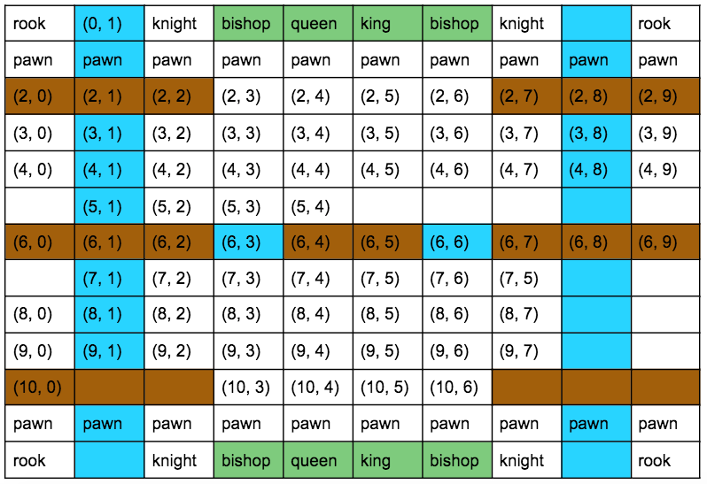

## Introduction 
(same as before)
Running the program starts a GUI that allows two humans or one human and a Player.AI to enjoy a standard game of chess or a
newly designed chess-based game with added features and rules. Once player type (human v human or human v Player.AI), game
type, and piece colour are chosen, a corresponding board is displayed with pieces initialized at their respective
starting positions. Taking turns, each player enters a move until the game ends. Each move must follow the piece
specific behaviours and game specific rules. If the current player is a Player.AI, a valid move is directly made.

## Chess
(same as before)
Each player makes one valid move on their piece during their turn. Invalid moves prompt the current player to reenter a
new move. An opponent's piece can be captured in the process if a move is made to take the opponent's piece's place. The
captured piece is wiped from the board.

A player wins when checkmate occurs: the opponent's king is under attack and no legal move can be made by the opponent
to help the king escape. The game can also end if a player exists the game to return to it at a later time.

### piece Specific Behaviours
pawn: 1 square directly forward, optional 2 squares directly forward if not yet moved  
rook: horizontal/vertical straight line, castling  
bishop: diagonal straight line  
knight: L-shape move, can "jump" over pieces  
queen: horizontal/vertical/diagonal line  
king: one square any direction, castling

## Super Chess

Each player can make one move per turn. They may also forfeit their turn. Each modified piece corresponds to health 
points and an attack level. An attack counts as a move wherein the attacking piece does not actually move. The attacked 
piece must be in the attacker's line of offence: the attacker must be able to move to the attacked piece's position 
according to its piece behaviours. This is so that when the piece is captured, the attacking piece can take its 
position. A piece is captured when it's health points are depleted.

The game ends when the king is dead, a player gives up, or a player exits the game.

The board consists of rivers, some bridges, and home safe zones. 
* **River** (blue): Only the pawn can cross the river. All other pieces must use the bridge. However, the knight can jump over
the river as long as it lands on a land type other than the river. The pawn is not *visible* in the river because it is 
"submerged". 
* **Bridges** (brown) are elevated. Therefore, pieces cannot attack a piece on the other side of the bridge. However, 
pieces can attack a piece on the bridge. If a piece is on the bridge, due to the high altitude, it can attack all 
*visible* pieces. All pieces can use the bridge and thus a piece can move onto and over the bridge as it pleases.
* **Home safe zones** (green): If a piece is in its own home safe zone, it cannot be attacked. However, it is still 
*visible* from the bridge, therefore pieces in its own home safe zone can still be attacked by pieces on the bridge. If 
a piece is in the opponent's home safe zone, it will be defenceless; opponent pieces can attack it, but it cannot 
attack opponent pieces.

Below is a picture of the 13x10 super chess board:  

Below is the health points and attack levels of pieces:  

|Piece|Pawn|Knight|Bishop|Rook|Queen|King|
|---|---|---|---|---|---|---|
|Health points (Hp)|5|3|4|4|2|2|
|Attack level      |6|5|1|1|2|7|

## Phase 2 Additional Functionalities

* A GUI displays the board. When a piece is clicked, its available moves are highlighted on the board.
* The game can save its state and reload.
* The game may be played with a timer. If players do not make their move(s) within the time limit, they automatically
forfeit their turn.
* The game will end if checkmate occurs.